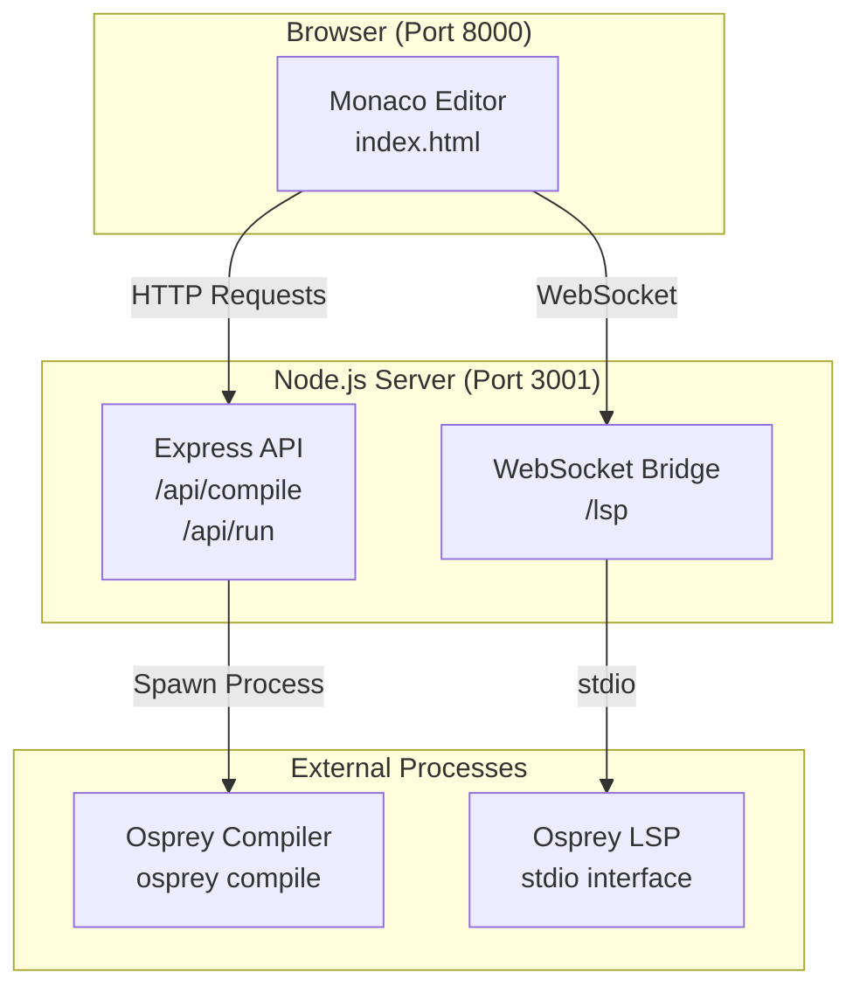

# Osprey Web Playground

Web-based Osprey compiler playground with Monaco editor and LSP support.

**Security**: All code execution runs in sandbox mode with HTTP, WebSocket, file system, and FFI access disabled for security.

## Architecture

**Node.js API server (port 3001)** - Handles compilation, execution, and LSP bridge



## Quick Start

```bash
./start.sh
```

Open http://localhost:8000

## Features

- Monaco editor with Osprey syntax highlighting
- Compile/run buttons with sandbox security
- WebSocket LSP connection
- Real-time error feedback
- Secure execution environment (no file system, HTTP, WebSocket, or FFI access)

## Requirements

- Node.js
- Python 3
- Osprey compiler in PATH

## Files

- `index.html` - Single-page playground app
- `src/server.js` - Node.js API and WebSocket server
- `start.sh` - Startup script 